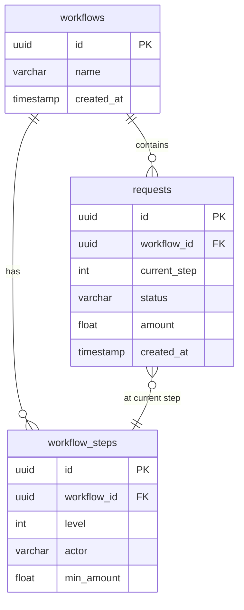
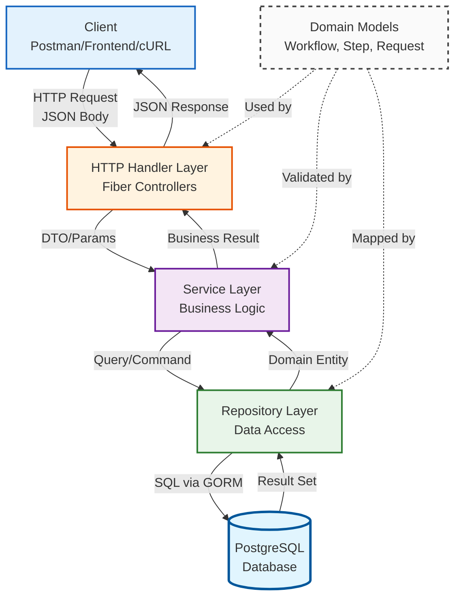
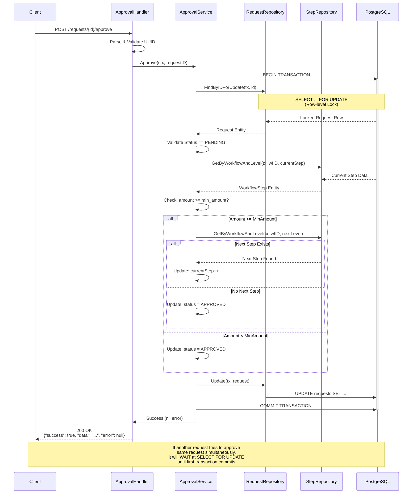

# Workflow Approval System API

A RESTful API service built with Golang for managing simple workflow approval systems such as purchase requests or other internal submissions. This project implements Clean Architecture principles with focus on code structure, business logic, data consistency, and error handling.

## Features
- Workflow management (create, list, view details)
- Multi-level approval steps with conditional logic
- Request submission and approval flow
- Concurrent approval handling with database transactions
- Request rejection with status tracking
- Pessimistic locking to prevent race conditions and double approval
- Clean Architecture implementation
- Comprehensive unit tests

## Tech Stack
- **Go** (Golang) with Fiber framework
- **PostgreSQL** with GORM ORM
- **Docker** for containerization
- **UUID** for primary keys
- **Air** for hot reload during development
- **Testify & SQLMock** for unit testing

## Prerequisites
- Go 1.21 or higher
- Docker & Docker Compose
- Git

## Installation & Setup

### Option 1: Run with Docker Compose (Recommended)

#### 1. Clone the repository
```bash
git clone https://github.com/ranandasatria/workflow-approval.git
cd workflow-approval
```

#### 2. Create `.env` file
Create a `.env` file in the root directory:
```env
DB_HOST=db
DB_PORT=5432
DB_USER=postgres
DB_PASSWORD=postgres
DB_NAME=workflow_db
DB_SSLMODE=disable
```

#### 3. Run with Docker Compose
```bash
# Build and start all services
docker-compose up --build

# Or run in detached mode
docker-compose up -d --build
```

The application will:
- Start PostgreSQL database on port `5432`
- Run automatic migrations
- Start API server on `http://localhost:9000`

#### 4. Stop the services
```bash
docker-compose down

# Stop and remove volumes
docker-compose down -v
```

### Option 2: Run Locally (Development)

#### 1. Clone the repository
```bash
git clone <your-repository-url>
cd workflow-approval
```

#### 2. Setup PostgreSQL with Docker
```bash
docker run --name workflow-postgres \
  -e POSTGRES_PASSWORD=postgres \
  -e POSTGRES_DB=workflow_db \
  -p 5432:5432 \
  -d postgres:15-alpine
```

#### 3. Create `.env` file
```env
DB_HOST=localhost
DB_PORT=5432
DB_USER=postgres
DB_PASSWORD=postgres
DB_NAME=workflow_db
DB_SSLMODE=disable
```

#### 4. Install dependencies
```bash
go mod tidy
```

#### 5. Run the application
```bash
# Development mode with hot reload
air

# Or run directly
go run cmd/server/main.go
```

The server will start on `http://localhost:9000`

### Running Tests
```bash
# Run all service tests
go test ./internal/service/... -v

# Run with coverage
go test ./internal/service/... -cover
```


## API Endpoints

| Method | Endpoint | Description | Request Body |
|--------|----------|-------------|--------------|
| **Workflows** |
| POST | `/api/workflows` | Create a new workflow | `{"name": "string"}` |
| GET | `/api/workflows` | Get all workflows | - |
| GET | `/api/workflows/{id}` | Get workflow by ID | - |
| **Workflow Steps** |
| POST | `/api/workflows/{id}/steps` | Add step to workflow | `{"level": int, "actor": "string", "min_amount": float}` |
| GET | `/api/workflows/{id}/steps` | Get all steps for a workflow | - |
| **Requests** |
| POST | `/api/requests` | Create a new request | `{"workflow_id": "uuid", "amount": float}` |
| GET | `/api/requests` | Get all requests | - |
| POST | `/api/requests/{id}/approve` | Approve a request | - |
| POST | `/api/requests/{id}/reject` | Reject a request | - |

## Response Format
All endpoints follow this standard response format:
```json
{
  "success": true,
  "data": {},
  "error": null
}
```

## Business Rules

### Request Flow
1. **Initial State**: Requests always start at step level 1 with status `PENDING`
2. **Approval Logic**:
   - If `amount >= min_amount` of current step → proceed to next step
   - If no next step exists → status becomes `APPROVED`
   - If `amount < min_amount` → status becomes `APPROVED` (meets minimum requirement)
3. **Rejection**: Request status becomes `REJECTED` when rejected
4. **Status Constraint**: Approval/rejection only allowed when status is `PENDING`

### Validation Rules
- Workflow name is required
- Step level must be unique per workflow
- Amount must be greater than 0
- Approval cannot be performed more than once (prevents double approval)

## Database Schema

### Entity-Relationship Diagram




## Architecture & Design Decisions

### System Architecture Overview


### Detailed Flow: Approve Request with Concurrency Handling


### Clean Architecture Layers

```
cmd/
└── server/          # Application entry point
internal/
├── handler/         # HTTP layer (Fiber handlers)
├── service/         # Business logic layer
├── repository/      # Data access layer (GORM)
├── model/           # Domain entities
├── router/          # Route definitions
└── app/             # Dependency injection container
```

### Key Design Decisions

**1. Concurrency Handling**
- **Approach**: Pessimistic locking using database transactions with `SELECT FOR UPDATE`
- **Implementation**: 
  - `FindByIDForUpdate()` uses `GORM's Clauses(clause.Locking{Strength: "UPDATE"})`
  - Entire approval/rejection logic wrapped in `db.Transaction()`
  - Row-level locking prevents concurrent modifications
- **Trade-off**: Slightly reduced throughput but guaranteed data consistency
- **Alternative considered**: Optimistic locking was considered but pessimistic locking provides stronger guarantees for approval workflows

**2. Repository Pattern**
- Each domain entity has dedicated repository interface
- Enables easy mocking for unit tests
- Clear separation between business logic and data access

**3. Service Layer Separation**
- `ApprovalService`: Handles both approve and reject operations
- `RequestService`: Manages request CRUD operations
- `WorkflowService` & `StepService`: Handle their respective domains
- Separation allows for independent testing and maintenance

**4. UUID for Primary Keys**
- Provides globally unique identifiers
- Better for distributed systems
- No sequential ID exposure

**5. Error Handling**
- Repository layer returns raw database errors
- Service layer translates to business-friendly error messages
- Handler layer determines appropriate HTTP status codes

## Assumptions & Trade-offs

### Assumptions
1. **Approval Order**: Steps must be sequential (level 1 → 2 → 3, etc.)
2. **Single Workflow Instance**: Each request goes through exactly one workflow
3. **No Step Modification**: Workflow steps cannot be modified after creation (only added)
4. **Amount Validation**: Only `min_amount` threshold is checked; no maximum limit
5. **Actor Field**: Currently informational only; not used for authentication/authorization

### Trade-offs
1. **Pessimistic Locking vs Performance**: 
   - Chose data consistency over maximum throughput
   - Acceptable for typical approval workflow volume
   
2. **Auto-Migration vs Manual Schema**:
   - Used GORM AutoMigrate for development speed
   - Production should use proper migration tool (e.g., golang-migrate)

3. **No Audit Trail** (Base Implementation):
   - Current design stores only final state
   - Audit log could be added as separate table (bonus feature)

4. **Simple Status Model**:
   - Three states only: PENDING, APPROVED, REJECTED
   - Could extend to: IN_PROGRESS, CANCELLED, etc.

## Testing Strategy

### Unit Tests Coverage
- ✅ Approval service logic (success scenario)
- ✅ Request validation (amount, workflow existence)
- ✅ Business rule validation

### Test Approach
- Mock repositories using `testify/mock`
- Database transaction testing with `go-sqlmock`
- Focus on business logic rather than database interactions

## API Testing

You can test the API endpoints using any HTTP client such as:
- **Postman** - Import endpoints and test interactively
- **cURL** - Command line testing


### Quick Test Flow

1. **Create a Workflow**
   - `POST /api/workflows`
   - Body: `{"name": "Purchase Approval"}`

2. **Add Approval Steps**
   - `POST /api/workflows/{workflow_id}/steps`
   - Body for Step 1: `{"level": 1, "actor": "Manager", "min_amount": 1000000}`
   - Body for Step 2: `{"level": 2, "actor": "Director", "min_amount": 5000000}`

3. **Create a Request**
   - `POST /api/requests`
   - Body: `{"workflow_id": "{workflow_id}", "amount": 1500000}`

4. **Approve/Reject Request**
   - `POST /api/requests/{request_id}/approve`
   - `POST /api/requests/{request_id}/reject`

5. **View Results**
   - `GET /api/requests` - See all requests with their status
   - `GET /api/workflows/{id}/steps` - View workflow steps configuration

## Future Improvements

- [ ] JWT authentication for secure access
- [ ] Pagination and filtering for list endpoints
- [ ] Audit log/history for approval actions
- [ ] Swagger/OpenAPI documentation
- [ ] Webhook notifications on status changes
- [ ] Conditional routing (parallel approvals, conditional steps)
- [ ] CI/CD pipeline integration

## Project Structure
```
workflow-approval/
├── cmd/
│   └── server/
│       └── main.go              # Application entry point
├── internal/
│   ├── app/
│   │   └── app.go               # Dependency injection container
│   ├── handler/                 # HTTP handlers
│   │   ├── approval_handler.go
│   │   ├── reject_handler.go
│   │   ├── request_handler.go
│   │   ├── step_handler.go
│   │   └── workflow_handler.go
│   ├── model/                   # Domain entities
│   │   ├── request.go
│   │   ├── workflow.go
│   │   └── workflow_step.go
│   ├── repository/              # Data access layer
│   │   ├── postgres.go
│   │   ├── request_repository.go
│   │   ├── step_repository.go
│   │   └── workflow_repository.go
│   ├── router/                  # Route definitions
│   │   ├── approval.go
│   │   ├── request.go
│   │   ├── router.go
│   │   ├── step.go
│   │   └── workflow.go
│   └── service/                 # Business logic
│       ├── approval_service.go
│       ├── approval_service_test.go
│       ├── reject_service.go
│       ├── request_service.go
│       ├── request_service_test.go
│       ├── shared_test.go
│       ├── step_service.go
│       └── workflow_service.go
├── .air.toml                    # Hot reload configuration
├── .env                         # Environment variables
├── .env.example                 # Environment variables template
├── Dockerfile                   # Docker image definition
├── docker-compose.yml           # Docker Compose configuration
├── go.mod                       # Go module definition
├── go.sum                       # Go module checksums
└── README.md                    # This file
```

## Docker Configuration

### Dockerfile
The application uses multi-stage build for optimized image size:
- **Builder stage**: Uses `golang:1.25-alpine` to compile the application
- **Runtime stage**: Uses `alpine:latest` with minimal dependencies
- Final image includes only the compiled binary and necessary certificates

### Docker Compose
The `docker-compose.yml` orchestrates two services:
- **PostgreSQL Database**: 
  - Runs on port `5432`
  - Includes health check to ensure database is ready
  - Persistent data storage using named volume
- **Application Service**: 
  - Waits for database to be healthy before starting
  - Automatically connects to database service
  - Exposes API on port `9000`

## License
This project is licensed under the MIT License.